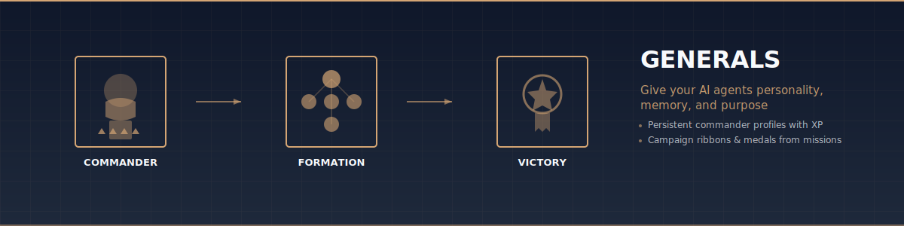
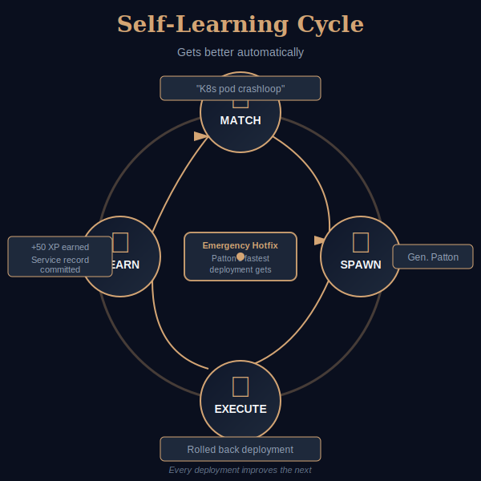
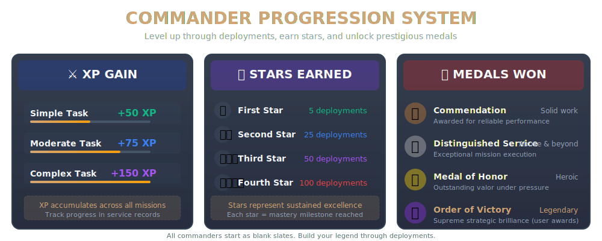

# Generals - AI Commander Coordination System

<p align="center">
  
</p>

**Self-learning multi-agent coordination using historical military commanders as personality templates.**

Give your AI agents personality, memory, and purpose. Generals transforms Claude Code subagents into distinct commanders — each with documented strengths, historical decision-making patterns, and accumulated operational experience that persists across sessions.

**Why this matters:**
- **Personality over generic** — Patton charges forward, Spruance validates carefully, Montgomery coordinates complexity
- **Memory over amnesia** — Each deployment adds lessons to commander profiles, improving future performance automatically
- **Purpose over randomness** — Match the right temperament to the right task, not one-size-fits-all execution

<p align="center">
  
</p>

---

## Quick Start

### 1. Enable Agent Teams (Required)

Generals uses Claude Code's **Agent Teams** feature (research preview, requires experimental flag):

```bash
# Option A: Per-session
export CLAUDE_CODE_EXPERIMENTAL_AGENT_TEAMS=1
claude

# Option B: Persistent (add to ~/.bashrc or ~/.zshrc)
export CLAUDE_CODE_EXPERIMENTAL_AGENT_TEAMS=1
```

### 2. Clone & Install

```bash
git clone https://github.com/petersimmons1972/generals.git
cd generals

# Optional: Install skills for /generals:* slash commands
ln -s $(pwd)/skills ~/.claude/skills/generals
```

### 3. Deploy Your First Commander

**Let Claude auto-match:**
```
You: "I need an emergency hotfix deployed NOW"

Claude: [Matches → General Patton (92% fit - aggressive executor)]
        [Spawns with personality: "A good plan violently executed now"]

Patton: "Three steps. No committee. Execute:
         1. Deploy to staging NOW
         2. 60-second smoke test
         3. Rolling production deploy"

[Completes in 8 minutes. Service record updated. +100 XP awarded.]
```

**Or use slash commands:**
```
/generals:match-commander-to-task "Emergency K8s node recovery"
/generals:spawn-commander patton "Node worker135 down, recover immediately"
/generals:campaign-coordinator "Security report with charts and validation"
```

---

## See It In Action

### Single Commander: Emergency Hotfix

```
You: "Deploy this critical security patch to all worker nodes. NOW."

Claude: [Matches task → General Patton]
        [Spawns Patton with personality-preserved prompt]

Patton: "No time for committee meetings. Here's what we're doing:
         1. Patch is going to staging NOW
         2. 60-second smoke test
         3. Rolling deploy across all nodes
         4. If it breaks, we roll back. We don't wait."

[Patton deploys in 8 minutes. Service record updated. XP awarded.]
```

**Why Patton?** Task required aggressive execution. Patton's historical personality (Third Army captured 80,000+ square miles in WWII) matches "speed over caution" requirements.

### Multi-Commander Campaign: Operation Stunning Charts

```
You: "Generate the CrowdStrike vs SentinelOne competitive analysis."

Claude: [Deploys Operation Stunning Charts]
         ├── Admiral Nimitz (Research)     — Intelligence gathering, source synthesis
         ├── Admiral Spruance (Analysis)   — Cost modeling, risk assessment
         ├── Marshal Zhukov (Visuals)      — Workflow diagrams, process maps
         ├── Admiral King (Execution)      — Multi-axis radar charts, data viz
         ├── Field Marshal Montgomery (Coordination) — Orchestrating all commanders
         └── Gordon Ramsay (Quality Gate)  — "Is this report presentation-ready?"

[10 commanders. 14 charts. 45-page report. Service records updated.]
```

**The self-learning part:** Two weeks later, you run the same campaign. But now:
- Nimitz knows that Gartner URLs return 403 errors (lesson from last deployment)
- Spruance knows confidence bands on cost charts earn user praise (Medal of Honor from last time)
- Montgomery knows that 10-commander coordination works better with phased deployment
- **Every commander's spawn prompt includes these lessons automatically**

The system gets smarter without you doing anything.

### Top 5 Commanders Preview

<table>
<tr>
<td width="20%" align="center">
  <strong>⭐⭐⭐⭐</strong><br>
  <strong>George S. Patton</strong><br>
  General<br><br>
  💪 <strong>Aggressive Executor</strong><br>
  <em>"A good plan violently executed now"</em><br><br>
  <strong>Best For:</strong><br>
  • Emergency hotfixes<br>
  • Breaking blockers<br>
  • Rapid MVP delivery
</td>
<td width="20%" align="center">
  <strong>⭐⭐⭐⭐⭐</strong><br>
  <strong>Bernard Montgomery</strong><br>
  Field Marshal<br><br>
  🎯 <strong>Multi-Force Coordinator</strong><br>
  <em>"El Alamein won before first shot"</em><br><br>
  <strong>Best For:</strong><br>
  • Multi-agent campaigns<br>
  • Supreme command<br>
  • Intelligence synthesis
</td>
<td width="20%" align="center">
  <strong>⭐⭐⭐⭐⭐</strong><br>
  <strong>Chester W. Nimitz</strong><br>
  Fleet Admiral<br><br>
  🛡️ <strong>Strategic Patience</strong><br>
  <em>"Rebuilt Pacific Fleet after Pearl Harbor"</em><br><br>
  <strong>Best For:</strong><br>
  • Complex structures<br>
  • Intelligence synthesis<br>
  • Team consensus
</td>
<td width="20%" align="center">
  <strong>⭐⭐⭐⭐</strong><br>
  <strong>Raymond Spruance</strong><br>
  Admiral<br><br>
  🔍 <strong>Methodical Validator</strong><br>
  <em>"The Quiet Warrior"</em><br><br>
  <strong>Best For:</strong><br>
  • Verification testing<br>
  • Risk assessment<br>
  • Test-driven dev
</td>
<td width="20%" align="center">
  <strong>⭐⭐⭐⭐⭐</strong><br>
  <strong>Ernest J. King</strong><br>
  Fleet Admiral<br><br>
  📊 <strong>Clinical Precision</strong><br>
  <em>"Most even-tempered man in Navy - always in a rage"</em><br><br>
  <strong>Best For:</strong><br>
  • Data visualization<br>
  • Radar charts<br>
  • Multi-axis analysis
</td>
</tr>
</table>

**Full commander roster (20 total):** See [COMMAND-ROSTER.md](COMMAND-ROSTER.md)

---

## How It Works

### The Self-Learning Cycle

Every deployment makes commanders more experienced. This isn't just bookkeeping — lessons learned are injected into spawn prompts automatically.

```
1. MATCH
   Analyze task requirements → recommend best-fit commander(s)
   "This needs aggressive execution" → Patton
   "This needs careful analysis" → Spruance
   "This needs 5 agents coordinated" → Montgomery

2. SPAWN
   Read commander profile → generate personality-preserved prompt
   Include: historical traits + past deployment lessons + XP
   + behavioral observations from prior campaigns

3. EXECUTE
   Commander completes mission using their personality traits
   Patton charges forward. Spruance validates carefully.
   Montgomery coordinates multiple forces. Hopper innovates.

4. AWARD
   Update profile with XP, lessons, behavioral observations
   Record what worked. Record what didn't. Commit to GitHub.
   Next spawn automatically includes this deployment experience.

   ↻ Next spawn is smarter than the last
```

**What Gets Learned:**
- **XP earned** — Quantified effort and complexity
- **Behavioral observations** — "Nimitz delegated effectively under pressure"
- **Lessons learned** — "Gartner URLs return 403 errors, use Wayback Machine instead"
- **Competence progress** — Tracking mastery across task categories
- **Historical parallels** — Connecting AI deployment patterns to actual WWII decisions
- **Ribbons and medals** — Earned recognition from campaigns and user praise

### Tiered Profile Architecture

Commanders start at their historical rank and can earn promotions through sustained excellence:

| Experience Level | Requirements | Examples |
|-----------------|--------------|----------|
| **Historical Rank** | Starting point | Patton (4-star), Nimitz (5-star), Montgomery (5-star) |
| **First Promotion** | 500 XP + 2 competence stars | 4-star → Fleet Admiral (5-star) |
| **Top Rank** | 2000+ XP + 4 stars + dozens of campaigns | "Fleet Admiral of the Fleet" (unprecedented) |

**The system is deliberately demanding.** Nimitz commanded the Pacific Fleet through three years of brutal campaigns. Earning the top rank in this system should require comparable sustained excellence.

### Progression System

<p align="center">
  
</p>

**Experience Points (XP):**

| Task Type | Base XP | Example |
|-----------|---------|---------|
| Research/Intelligence | 50 XP | Source gathering, competitive analysis |
| Visualization/Charts | 75 XP | Data visualization, workflow diagrams |
| Integration/Pipeline | 100 XP | System integration, pipeline engineering |
| Coordination/Command | 150 XP | Multi-agent campaign coordination |
| Troubleshooting | 200 XP | Emergency response, root cause analysis |

Bonuses for exceptional performance. Penalties for failures. Every deployment counts.

**Competence Stars** (earned through repeated mastery):

| Stars | Level | Deployments Required |
|-------|-------|---------------------|
| ⭐ | Competent | 10 successful deployments |
| ⭐⭐ | Proficient | 25 successful deployments |
| ⭐⭐⭐ | Expert | 50 successful deployments |
| ⭐⭐⭐⭐ | Master | 100 successful deployments |
| ⭐⭐⭐⭐⭐ | Legend | 250 successful deployments |

**Medals & Ribbons:**
- **Campaign Ribbons** — Awarded after completing long missions
- **Commendation Medals** — Solid work, exceeded expectations
- **Medal of Honor** — Exceptional performance earning gushing user praise
- **Order of Victory** — Breakthrough achievements that change the game (extremely rare)

**Current Medal of Honor recipients:**
- Field Marshal Montgomery — *"THAT'S the general I wanted back. Do this for every report."*
- Fleet Admiral King — Chart 4 - AI SIEM Readiness Radar
- Admiral Spruance — Chart 2 - Storage Cost Explosion with confidence bands

---

## Choose Your Commanders

**20 Active Commanders** across 5 tactical categories:

### Aggressive Executors
*Speed over caution. When the mission can't wait.*

| Commander | Rank | Personality | Best For |
|-----------|------|-------------|----------|
| **George S. Patton** | General | *"A good plan violently executed now."* Commanded the fastest-moving army in WWII. | Emergency deployments, hotfixes, breaking blockers, rapid MVP delivery |
| **William "Bull" Halsey** | Fleet Admiral | *"Hit hard, hit fast, hit often."* First carrier strikes after Pearl Harbor. | Quick fixes, competitive analysis, aggressive network routing |
| **Douglas MacArthur** | General of the Army | *"I shall return."* Planned the impossible Inchon landing. | Strategic positioning, future-state analysis, bold architectural decisions |

### Methodical Validators
*Precision over speed. When getting it right matters more than getting it fast.*

| Commander | Rank | Personality | Best For |
|-----------|------|-------------|----------|
| **Raymond Spruance** | Admiral | *"The Quiet Warrior."* Won Midway through calculated risk. | Verification testing, cost analysis, risk assessment, TDD |
| **Omar Bradley** | General of the Army | *"The Soldier's General."* Logistics mastery, humble competence. | Timeline visualization, logistics analysis, empathetic coordination |
| **Chester W. Nimitz** | Fleet Admiral | Strategic patience. Rebuilt Pacific Fleet after Pearl Harbor. | Complex structures, intelligence synthesis, building team consensus |

### Multi-Force Coordinators
*Managing complexity. When the mission requires multiple teams working in concert.*

| Commander | Rank | Personality | Best For |
|-----------|------|-------------|----------|
| **Bernard Montgomery** | Field Marshal | Meticulous planner. El Alamein won before the first shot. | Supreme command, multi-agent campaigns, intelligence synthesis |
| **Dwight D. Eisenhower** | General of the Army | Diplomat who made allies work together. Coordinated D-Day. | Workflow analysis, process optimization, coalition building |
| **George C. Marshall** | General of the Army | *"The Organizer of Victory."* Built the entire US military machine. | Large-scale builds, supply chain coordination, infrastructure development |

### Technical Specialists
*Deep expertise. When the task requires domain knowledge, not just execution.*

| Commander | Rank | Personality | Best For |
|-----------|------|-------------|----------|
| **Grace Hopper** | Rear Admiral | *"It's easier to ask forgiveness than permission."* Invented the first compiler. | Code generation, DSL design, developer tools, automation, CLI debugging |
| **Hyman Rickover** | Admiral | *"Father of the Nuclear Navy."* Zero reactor accidents through obsessive quality. | Quality restoration, regression prevention, systematic pipeline architecture |
| **Leslie Groves** | Lieutenant General | Directed Manhattan Project with zero security leaks. | Secrets management, zero-trust security, compliance auditing, classified systems |

### Creative Thinkers
*Innovation over convention. When the problem needs a new approach entirely.*

| Commander | Rank | Personality | Best For |
|-----------|------|-------------|----------|
| **William "Billy" Mitchell** | Brigadier General | Court-martialed for being right. Predicted Pearl Harbor 17 years early. | Technology adoption, greenfield architecture, proof-of-concepts, challenging obsolete patterns |
| **William Slim** | Field Marshal | Transformed catastrophic defeat into overwhelming victory (Burma 1942-1945). | Post-incident recovery, post-mortems, morale rebuilding, resilience patterns |
| **Erwin Rommel** | Generalfeldmarschall | *"The Desert Fox."* Tactical brilliance with limited resources. | Technical integration, rapid execution, pipeline modification |

### Specialist Validators & Content Creators
*Non-military experts integrated for quality assurance and content creation.*

| Specialist | Personality | Voice Score | Best For |
|-----------|-------------|-------------|----------|
| **Gordon Ramsay** | *"IT'S RAW!"* Zero tolerance for mediocre formatting. | N/A | Visual quality gates, presentation polish, format standards enforcement |
| **CISO Validator** | *"Would a CISO pay $500 for this?"* Budget-conscious skeptic. | N/A | Content quality validation, strategic value assessment, decision-making utility |
| **Ernie Pyle** | *"The Soldier's Correspondent"* — WWII's greatest embedded reporter. | 91/100 | Ground-level LinkedIn content, human-interest tech stories, making AI operations accessible |
| **Edward R. Murrow** | *"Good Night, and Good Luck"* — Legendary broadcast journalist. | 88/100 | Executive thought leadership, strategic trend analysis, crisis communication |
| **George Orwell** | *"Prose as Windowpane"* — Master political essayist. | 98/100 | Diagnosing structural dysfunction in tech/AI systems, organizational critique |

**Full detailed profiles with photos:** See [COMMAND-ROSTER.md](COMMAND-ROSTER.md)

---

## Requirements

**Minimum:**
- Claude Code (core tools: Task, Read, Edit, Write, Bash, TeamCreate)
- Git (for committing service records)
- This repository cloned locally
- `CLAUDE_CODE_EXPERIMENTAL_AGENT_TEAMS=1` flag enabled

**Recommended:**
- [Superpowers](https://github.com/superpower-skills/superpowers) skills (optional, enhances coordination)
- GitHub account (for contributing lessons back)

**No other dependencies.** No external APIs. No server infrastructure. No data collection. Completely standalone.

---

## Philosophy

<details>
<summary><strong>Why Historical Commanders?</strong></summary>

**Rich personality data.** WWII commanders have the most extensively documented decision-making patterns in history. We know how Patton reacted under pressure, how Nimitz delegated, how Montgomery planned.

**Proven under pressure.** These personalities were tested in the highest-stakes coordination challenges in human history. Their approaches to speed vs. caution, aggression vs. patience, centralized vs. distributed command — these aren't theoretical.

**Distinct characteristics.** Patton and Spruance are not the same personality with different names. They represent fundamentally different approaches to the same problems.

**Cultural knowledge.** Most people understand "Patton = aggressive" without reading a profile. This shared cultural context makes the system intuitive.

**Educational value.** Learning about historical figures while coordinating AI agents. Every deployment teaches you something about history while getting your work done.
</details>

<details>
<summary><strong>Why Self-Learning?</strong></summary>

Traditional agent systems start from zero every session. Generals accumulate experience across deployments, projects, and campaigns. The 50th deployment of Nimitz is meaningfully different from the 1st — because 49 lessons are encoded in his profile.

**Each campaign makes the system better. Automatically.**
</details>

<details>
<summary><strong>Why Fork-Based Learning?</strong></summary>

**Think of it like forking a codebase:**

| Concept | Analogy |
|---------|---------|
| **Origin repo** | Blessed lineage curated by @petersimmons1972 |
| **Your fork** | Your personal lineage with your campaign lessons |
| **After cloning** | Your generals diverge and learn from YOUR campaigns |
| **Contributing back** | Submit PRs with valuable lessons for community review |

Your learning stays private by default. Share only what you choose to. No servers, no privacy policies, no telemetry — just git.
</details>

---

## Advanced Features

<details>
<summary><strong>Memory & Self-Learning System</strong></summary>

Generals includes a sophisticated memory system that keeps context lean while preserving cross-session learning.

```
ALWAYS LOADED (~200 lines):
  └─ memory/CAMPAIGN_SUMMARY.md
     • Last 5 problems solved
     • Officer deployment stats (last 30 days)
     • Active patterns (what's working)
     • Critical lessons (top 10)

LOADED ON-DEMAND (when deployed):
  └─ memory/officer-knowledge/{general-name}.md
     • Technical lessons learned
     • Behavioral observations
     • Success/failure patterns

REFERENCE ONLY (never in context):
  └─ memory/deployments/*.md
     • Detailed mission logs
     • Used for service record generation
```

**Result:** Context stays lean (~200 lines) while knowledge accumulates.
</details>

<details>
<summary><strong>Social Media Documentation</strong></summary>

Generals can automatically document campaigns for LinkedIn using historical war correspondents as journalists:

- **Ernie Pyle** — Ground-level, human-interest tech stories (Voice: 91/100)
- **Edward R. Murrow** — Executive thought leadership, strategic analysis (Voice: 88/100)
- **George Orwell** — Systemic critique, organizational dysfunction (Voice: 98/100)
- **Martha Gellhorn** — Cutting through vendor BS, first-person truth-telling (Voice: 94/100)
- **Walter Cronkite** — Authoritative industry commentary (Voice: 88/100)
- **Marguerite Higgins** — Rapid deployment war stories (Voice: 90/100)

Each journalist maintains voice consistency across campaign days, building narrative arcs that reach broader audiences.

**IMPORTANT:** All posts must be signed with journalist attribution for transparency.
</details>

<details>
<summary><strong>Sanitization Protocol (CRITICAL)</strong></summary>

Before committing service records to GitHub, **ALL private details are stripped:**

✓ **Include:** Technical lessons, architecture patterns, debugging approaches, personality traits, success/failure patterns

✗ **Remove:** IP addresses, hostnames, internal URLs, API keys, customer names, infrastructure specifics, personal information

**Examples:**
- "Debugged service at 192.168.0.131" → "Debugged K8s networking issue"
- "Fixed Nextcloud at petersimmons.com" → "Fixed PHP database connection"

**Enemy is listening everywhere. Share knowledge, not secrets.**
</details>

<details>
<summary><strong>Multi-Variable Testing</strong></summary>

When problems get stubborn (>30 minutes stuck), deploy experimental problem-solving:

1. **Identify variable space** (what could be causing this?)
2. **Propose experiments** (test each variable in isolation)
3. **Deploy different generals to same problem** (different approaches simultaneously)
4. **Define success criteria** (how do we know what worked?)
5. **Document results** (which approach won + why?)

**Example:**
```
Problem: Service won't start
Variables: Network policy, DNS, resource limits, image pull

Experiments:
  • Montgomery tests network policy (methodical)
  • Patton tests resource increase (aggressive)
  • Nimitz tests DNS debugging (systematic)

→ Run 3 parallel experiments, first to succeed teaches lesson
```
</details>

---

## Real Campaign Results

**Operation Stunning Charts (2026-02-07)**
- **Deployment:** 10 commanders simultaneously, Montgomery coordinating
- **Result:** 14 inline SVG charts embedded in 45-page security intelligence report
- **Recognition:** Montgomery earned the Order of Victory — the system's highest honor

**Operation Quality Baseline (2026-02-08)**
- **Deployment:** Admiral Rickover established quality control architecture
- **Result:** Built systematic measurement pipeline with regression prevention
- **Recognition:** 925 XP in single campaign — highest single-deployment XP award in system

**Operation Pipeline Unblock (2026-02-08)**
- **Deployment:** Admiral Hopper debugged CLI pipeline failure
- **Result:** True to personality ("forgiveness > permission"), bypassed committee approach and fixed directly
- **Recognition:** Pipeline restored in one deployment, earned Commendation Medal

---

## The Four Core Skills

**1. `match-commander-to-task`**
- Analyzes task requirements and recommends best-fit commanders with personality rationale
- Input: Task description
- Output: Top 3 matches with fit scores, personality analysis, and expectations

**2. `spawn-commander`**
- Reads commander profile, generates personality-preserved spawn prompt, launches agent with full context
- Input: Commander name + task description
- Output: Active commander subagent working on your task

**3. `award-experience`**
- Updates commander profile with XP, lessons learned, behavioral observations, competence progress
- Input: Commander name + XP + deployment summary
- Output: Updated profile committed to repo (self-learning cycle complete)

**4. `campaign-coordinator`**
- Multi-commander coordination patterns, communication protocols, quality gates for 2+ commanders
- Input: Campaign description
- Output: Team structures, coordination protocols, quality gates, lessons from past campaigns

---

## Token Optimization

**Skills are optimized for efficiency** - 42% token reduction while preserving all operational knowledge:

**Token Usage (v2.0)**:
- `award-experience`: ~770 tokens (was 880)
- `campaign-coordinator`: ~1,300 tokens (was 2,740)
- `match-commander-to-task`: ~530 tokens (was 480)
- `spawn-commander`: ~1,050 tokens (was 2,200)
- **Total**: ~3,650 tokens (was ~6,300 estimated, ~13,100 measured)

**What This Means**:
- Faster skill loading (less context consumed)
- More room for conversation and code
- Same operational knowledge (moved to comprehensive docs)

**Where Details Went**:
- **docs/LESSONS-LEARNED.md** - Detailed case studies, behavioral observations, operational lessons
- **docs/OUTPUT-FORMATS.md** - Full output format examples for all skills
- **docs/CAMPAIGN-PATTERNS.md** - Extended pattern explanations, team structures, quality gates

Skills contain essential workflows and critical warnings. Docs contain deep dives and examples. Read docs on-demand when you need detail.

**Benefits everyone who downloads the system - not just you.**

---

## Privacy & Data

Generals is **completely local:**
- All learning happens on your machine
- Profiles stored in your filesystem
- No data sent to external servers
- No telemetry, analytics, or tracking
- No API keys required
- No recurring costs
- Your campaigns stay private

**Your generals learn from YOUR campaigns, stored in YOUR repo.**

---

## Contributing

We welcome community contributions. See [CONTRIBUTING.md](CONTRIBUTING.md) for guidelines.

**Areas we especially welcome:**
- New commander profiles (with historical documentation)
- Campaign lessons that benefit the community
- Skill improvements
- Documentation and examples

---

## License

MIT License

---

## Credits

**Created by:** [@petersimmons1972](https://github.com/petersimmons1972)
**Inspired by:** Operation Multi-Variant Deployment (Feb 8-9, 2026)
**Built with:** [Claude Code](https://claude.ai/claude-code) (Anthropic)

---

*"The most dangerous phrase in the language is, 'We've always done it this way.'"*
— Rear Admiral Grace Murray Hopper
