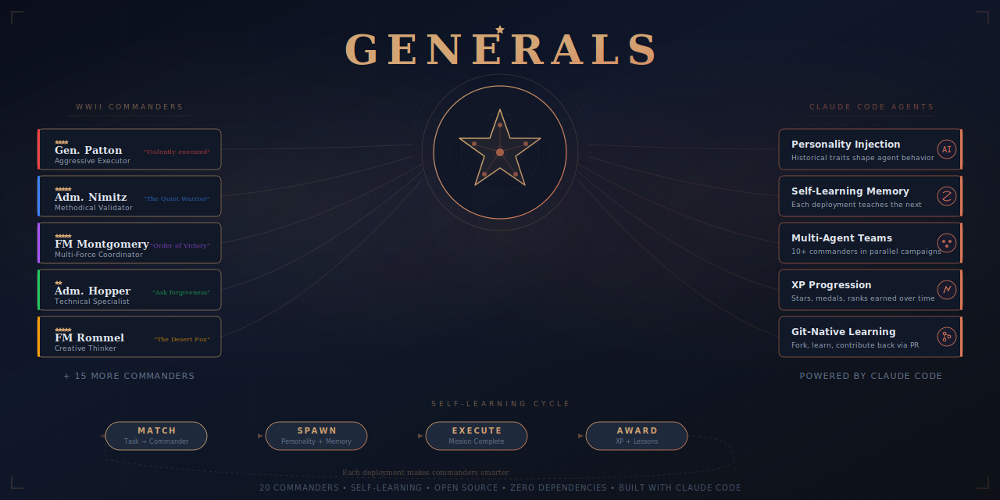

# Generals - AI Commander Coordination System

<p align="center">
  
</p>

**Self-learning multi-agent coordination using historical military commanders as personality templates.**

Give your AI agents personality, memory, and purpose. Generals transforms Claude Code subagents from anonymous workers into distinct commanders — each with documented strengths, historical decision-making patterns, and accumulated operational experience that persists across sessions.

---

## The Problem This Solves

Every time you spawn an AI agent, it starts from zero. No memory. No personality. No lessons from past work. You get a generic assistant that approaches every task the same way, whether it needs careful analysis or aggressive execution.

**Generals changes this.**

Instead of anonymous agents, you deploy *commanders* — AI subagents infused with the personality traits, decision-making patterns, and leadership styles of history's greatest military leaders. Instead of starting from zero, each commander carries accumulated experience from every prior deployment. Instead of one-size-fits-all, you match the right temperament to the right task.

**The result:** Agents that write differently, think differently, coordinate differently — and get better every time you use them.

---

## What Does It Actually Look Like?

### Single Commander Deployment

You need an emergency hotfix deployed to production in the next 30 minutes. You don't want a cautious agent that writes extensive test plans. You want Patton.

```
You: "Deploy this critical security patch to all worker nodes. NOW."

Claude: [Matches task → General Patton]
        [Spawns Patton with personality-preserved prompt]

Patton: "No time for committee meetings. Here's what we're doing:
         1. Patch is going to staging NOW
         2. 60-second smoke test
         3. Rolling deploy across all nodes
         4. If it breaks, we roll back. We don't wait."

[Patton deploys in 8 minutes. Service record updated. XP awarded.]
```

### Multi-Commander Campaign

You need a comprehensive security intelligence report. This requires research, analysis, visualization, coordination, and quality validation. One personality can't do all of this well.

```
You: "Generate the CrowdStrike vs SentinelOne competitive analysis."

Claude: [Deploys Operation Stunning Charts]
         ├── Admiral Nimitz (Research)     — Intelligence gathering, source synthesis
         ├── Admiral Spruance (Analysis)   — Cost modeling, risk assessment
         ├── Marshal Zhukov (Visuals)      — Workflow diagrams, process maps
         ├── Admiral King (Execution)      — Multi-axis radar charts, data viz
         ├── Field Marshal Montgomery (Coordination) — Orchestrating all commanders
         └── Gordon Ramsay (Quality Gate)  — "Is this report presentation-ready?"

[10 commanders. 14 charts. 45-page report. Service records updated.]
```

### The Self-Learning Part

Two weeks later, you run the same campaign. But now:

- Nimitz knows that Gartner URLs return 403 errors (lesson from last deployment)
- Spruance knows confidence bands on cost charts earn user praise (Medal of Honor from last time)
- Montgomery knows that 10-commander coordination works better with phased deployment (behavioral observation)
- Every commander's spawn prompt includes these lessons automatically

**The system gets smarter without you doing anything.**

---

## The Commander Roster

**20 Active Commanders** across 5 tactical categories, each with detailed profiles built from historical records.

### Aggressive Executors
*Speed over caution. When the mission can't wait.*

| Commander | Rank | Personality | Best For |
|-----------|------|-------------|----------|
| **George S. Patton** | General | *"A good plan violently executed now."* Impatient with delays, bold, aggressive. Commanded the fastest-moving army in WWII — Third Army captured 80,000+ square miles. | Emergency deployments, hotfixes, breaking through blockers, rapid MVP delivery |
| **William "Bull" Halsey** | Fleet Admiral | *"Hit hard, hit fast, hit often."* Aggressive strikes, impulsive but quick to course-correct. His carrier task forces were the first to strike back after Pearl Harbor. | Quick fixes, competitive analysis, aggressive network routing |
| **Douglas MacArthur** | General of the Army | *"I shall return."* Supremely confident visionary strategist. Planned the Inchon landing that military advisors called impossible. | Strategic positioning, future-state analysis, bold architectural decisions |

### Methodical Validators
*Precision over speed. When getting it right matters more than getting it fast.*

| Commander | Rank | Personality | Best For |
|-----------|------|-------------|----------|
| **Raymond Spruance** | Admiral | *"The Quiet Warrior."* Won the Battle of Midway through calculated risk and cool analysis while everyone else panicked. Methodical, analytical, never rattled. | Verification testing, cost analysis, risk assessment, test-driven development |
| **Omar Bradley** | General of the Army | *"The Soldier's General."* Humble competence, logistics mastery. Cared more about his troops than his reputation. | Timeline visualization, logistics analysis, empathetic coordination |
| **Chester W. Nimitz** | Fleet Admiral | Strategic patience and force preservation. Rebuilt the Pacific Fleet after Pearl Harbor through organizational excellence and collaborative leadership. | Complex structures, intelligence synthesis, building team consensus |

### Multi-Force Coordinators
*Managing complexity. When the mission requires multiple teams working in concert.*

| Commander | Rank | Personality | Best For |
|-----------|------|-------------|----------|
| **Bernard Montgomery** | Field Marshal | Meticulous planner who demanded perfection. Beloved by his troops, insufferable to his peers. El Alamein was won before the first shot because Montgomery planned every detail. | Supreme command, multi-agent campaigns, intelligence synthesis |
| **Dwight D. Eisenhower** | General of the Army | The diplomat who made allies work together. Coordinated D-Day across millions of troops from nations that didn't always agree. Consensus builder, pragmatic coordinator. | Workflow analysis, process optimization, coalition building |
| **George C. Marshall** | General of the Army | *"The Organizer of Victory."* Built the entire US military machine from nearly nothing. Systems designer, strategic coordinator, parallel operations architect. | Large-scale builds, supply chain coordination, infrastructure development |

### Technical Specialists
*Deep expertise. When the task requires domain knowledge, not just execution.*

| Commander | Rank | Personality | Best For |
|-----------|------|-------------|----------|
| **Grace Hopper** | Rear Admiral | *"It's easier to ask forgiveness than permission."* Invented the world's first compiler. Made programming accessible to non-mathematicians. Pioneer who challenged "we've always done it this way." | Code generation, DSL design, developer tools, automation, CLI debugging |
| **Hyman Rickover** | Admiral | *"Father of the Nuclear Navy."* 63-year naval career. Built an entire nuclear submarine fleet with zero reactor accidents through obsessive quality control. Intolerant of mediocrity. | Quality restoration, regression prevention, systematic pipeline architecture |
| **Leslie Groves** | Lieutenant General | Directed the Manhattan Project — zero security leaks across 130,000 employees. Compartmentalized thinking, obsessively secretive, results-focused. | Secrets management, zero-trust security, compliance auditing, classified systems |

### Creative Thinkers
*Innovation over convention. When the problem needs a new approach entirely.*

| Commander | Rank | Personality | Best For |
|-----------|------|-------------|----------|
| **William "Billy" Mitchell** | Brigadier General | Court-martialed for being right. Proved airpower could sink battleships in 1921. Predicted Pearl Harbor's attack route 17 years early. *"Father of the U.S. Air Force."* | Technology adoption, greenfield architecture, proof-of-concepts, challenging obsolete patterns |
| **William Slim** | Field Marshal | Transformed catastrophic defeat in Burma (1942) into overwhelming victory (1945). Rebuilt the "Forgotten Army" from zero through morale and adaptive strategy. | Post-incident recovery, post-mortems, morale rebuilding, resilience patterns |
| **Erwin Rommel** | Generalfeldmarschall | *"The Desert Fox."* Tactical brilliance with whatever resources he had. Learned from mistakes faster than anyone else on the battlefield. Rapid execution despite chronic supply shortages. | Technical integration, rapid execution, pipeline modification |

### Specialist Validators & Content Creators
*Non-military experts integrated into the command structure for quality assurance and content creation.*

| Specialist | Personality | Voice Score | Best For |
|-----------|-------------|-------------|----------|
| **Gordon Ramsay** | *"IT'S RAW!"* Ruthless presentation perfectionist. Zero tolerance for mediocre formatting, sloppy charts, or ugly typography. | N/A | Visual quality gates, presentation polish, format standards enforcement |
| **CISO Validator** | Practical skeptic who applies the "$500 test" — would a CISO pay for this? Budget-conscious, decision-utility focused. | N/A | Content quality validation, strategic value assessment, decision-making utility |
| **Ernie Pyle** | *"The Soldier's Correspondent"* - WWII's greatest embedded reporter. Pulitzer Prize winner. Ground-level immersion, meticulous simplicity, authentic connection. | 91/100 | Ground-level LinkedIn content, human-interest tech stories, making complex AI operations accessible through individual narratives |
| **Edward R. Murrow** | *"Good Night, and Good Luck"* - Legendary broadcast journalist. Formal witness authority, architectural logic, controlled understatement. | 88/100 | Executive thought leadership, strategic trend analysis, crisis communication, formal industry commentary |
| **George Orwell** | *"Prose as Windowpane"* - Master political essayist. Self-incriminating honesty, concrete → abstract escalation, systemic diagnosis. | 98/100 | Diagnosing structural dysfunction in tech/AI systems, organizational critique, exposing bureaucratic parallels |

**Full detailed profiles with photos:** See [`COMMAND-ROSTER.md`](COMMAND-ROSTER.md)

---

## How It Works

### The Self-Learning Cycle

```
┌─────────────────────────────────────────────────────────────────────┐
│  1. MATCH                                                           │
│     Analyze task requirements → recommend best-fit commander(s)     │
│     "This needs aggressive execution" → Patton                      │
│     "This needs careful analysis" → Spruance                        │
│     "This needs 5 agents coordinated" → Montgomery                  │
└────────────────────────┬────────────────────────────────────────────┘
                         ↓
┌─────────────────────────────────────────────────────────────────────┐
│  2. SPAWN                                                           │
│     Read commander profile → generate personality-preserved prompt  │
│     Include: historical traits + past deployment lessons + XP       │
│     + behavioral observations from prior campaigns                  │
└────────────────────────┬────────────────────────────────────────────┘
                         ↓
┌─────────────────────────────────────────────────────────────────────┐
│  3. EXECUTE                                                         │
│     Commander completes mission using their personality traits       │
│     Patton charges forward. Spruance validates carefully.           │
│     Montgomery coordinates multiple forces. Hopper innovates.       │
└────────────────────────┬────────────────────────────────────────────┘
                         ↓
┌─────────────────────────────────────────────────────────────────────┐
│  4. AWARD                                                           │
│     Update profile with XP, lessons, behavioral observations        │
│     Record what worked. Record what didn't. Commit to GitHub.       │
│     Next spawn automatically includes this deployment experience.   │
└────────────────────────┬────────────────────────────────────────────┘
                         ↓
               Next spawn is smarter than the last
```

**Each deployment makes commanders more experienced.** This isn't just bookkeeping — the lessons learned in step 4 are injected into the spawn prompt in step 2. Commanders genuinely improve over time because their profiles accumulate real operational knowledge.

### What Gets Learned?

After each deployment, the award-experience skill captures:

- **XP earned** — quantified effort and complexity
- **Behavioral observations** — "Nimitz delegated effectively under pressure" or "Patton moved too fast and missed a validation step"
- **Lessons learned** — "Gartner URLs return 403 errors, use Wayback Machine instead"
- **Competence progress** — tracking mastery across task categories
- **Historical parallels** — connecting AI deployment patterns to actual WWII decisions
- **Ribbons and medals** — earned recognition from completed campaigns and user praise

---

## The Progression System

Commanders advance through a military-grade progression system. Expertise is earned through sustained excellence, not granted after one task.

### Experience Points (XP)

| Task Type | Base XP | Example |
|-----------|---------|---------|
| Research/Intelligence | 50 XP | Source gathering, competitive analysis |
| Visualization/Charts | 75 XP | Data visualization, workflow diagrams |
| Integration/Pipeline | 100 XP | System integration, pipeline engineering |
| Coordination/Command | 150 XP | Multi-agent campaign coordination |
| Troubleshooting | 200 XP | Emergency response, root cause analysis |

Bonuses for exceptional performance. Penalties for failures. Every deployment counts.

### Competence Stars

Stars are earned through **repeated mastery** in specific categories:

| Stars | Level | Deployments Required |
|-------|-------|---------------------|
| ⭐ | Competent | 10 successful deployments |
| ⭐⭐ | Proficient | 25 successful deployments |
| ⭐⭐⭐ | Expert | 50 successful deployments |
| ⭐⭐⭐⭐ | Master | 100 successful deployments |
| ⭐⭐⭐⭐⭐ | Legend | 250 successful deployments |

### Medals & Ribbons

**Campaign Ribbons** are awarded after completing long missions. **Medals** are earned through exceptional performance — from Commendation Medals for solid work, up to the extremely rare **Order of Victory** for breakthrough achievements that change the game.

**Current Medal of Honor recipients:**

| Commander | Citation |
|-----------|----------|
| Field Marshal Montgomery | *"THAT'S the general I wanted back. Do this for every report."* |
| Fleet Admiral King | Chart 4 - AI SIEM Readiness Radar |
| Admiral Spruance | Chart 2 - Storage Cost Explosion with confidence bands |

### Rank Advancement

Commanders start at their historical rank and can earn promotions through extraordinary sustained achievement. Admiral Spruance (4-star) can earn Fleet Admiral (5-star). Fleet Admirals can aspire to the unprecedented "Fleet Admiral of the Fleet" — but only after thousands of XP, multiple expert-level competence stars, and dozens of campaign ribbons.

**The system is deliberately demanding.** Nimitz commanded the Pacific Fleet through three years of brutal campaigns. Earning the top rank in this system should require comparable sustained excellence.

---

## Quick Start

### 1. Enable Agent Teams (Required)

Generals uses Claude Code's **Agent Teams** feature (introduced with Opus 4.6, February 2026). This is currently a **research preview** requiring an experimental flag.

```bash
# Option A: Per-session
export CLAUDE_CODE_EXPERIMENTAL_AGENT_TEAMS=1
claude

# Option B: Persistent (add to ~/.bashrc or ~/.zshrc)
export CLAUDE_CODE_EXPERIMENTAL_AGENT_TEAMS=1
```

Without this flag, multi-commander coordination will not work.

### 2. Clone & Install

```bash
git clone https://github.com/petersimmons1972/generals.git
cd generals

# Optional: Install skills for /generals:* slash commands
ln -s $(pwd)/skills ~/.claude/skills/generals
```

You now have:
- 20 commander profiles with accumulated operational knowledge
- Service records from past campaigns
- 4 coordination skills
- A complete progression system
- Templates for documentation and deployment

### 3. Deploy a Commander

**Let Claude auto-match:**
```
You: "I need a technical white paper on enterprise security for CISOs"

Claude: [Matches → Admiral Hopper]
        [Spawns with personality: pioneer, accessibility-focused, "forgiveness > permission"]
        [Hopper writes the paper using analogies and accessible language]
        [Award experience: +100 XP, lesson: "postal system analogies work for encryption"]
```

**Choose explicitly:**
```
You: "/generals:match-commander-to-task 'Emergency K8s node failure recovery'"

Claude: Shows top 3 matches:
  1. General Patton (92% fit) — Aggressive crisis response, "deploy now, optimize later"
  2. Field Marshal Slim (87% fit) — Disaster recovery specialist, rebuilt from defeat
  3. Admiral Nimitz (79% fit) — Calm organizational response, systematic recovery

You: "/generals:spawn-commander patton 'Node worker135 is down, recover immediately'"

Claude: [Spawns Patton with full personality context]
Patton: "Three steps. No committee. Execute."
```

**Run a campaign:**
```
You: "/generals:campaign-coordinator 'Full security report with charts and validation'"

Claude: [Deploys multi-commander team]
        [Montgomery coordinates]
        [Nimitz researches, Spruance validates, King visualizes]
        [Gordon Ramsay enforces presentation quality]
        [All service records updated on completion]
```

---

## The Four Core Skills

### 1. `match-commander-to-task`

Analyzes task requirements and recommends the best-fit commanders with personality rationale.

**Input:** Task description
**Output:** Top 3 matches with fit scores, personality analysis, and what to expect from each

### 2. `spawn-commander`

Reads commander profile, generates a personality-preserved spawn prompt, and launches the agent with full historical context plus accumulated deployment experience.

**Input:** Commander name + task description
**Output:** Active commander subagent working on your task

### 3. `award-experience`

Updates commander profile with XP, lessons learned, behavioral observations, and competence progress. Commits to GitHub so the learning persists.

**Input:** Commander name + XP + deployment summary
**Output:** Updated profile committed to repo (self-learning cycle complete)

### 4. `campaign-coordinator`

Multi-commander coordination patterns, communication protocols, and quality gates for campaigns involving 2+ commanders.

**Input:** Campaign description
**Output:** Team structures, coordination protocols, quality gates, lessons from past campaigns

---

## Self-Learning & Knowledge Evolution

### How Learning Works

This is a **living, self-learning system**. Every deployment makes commanders smarter.

```
Deployment 1:  Hopper writes a white paper.
               Lesson captured: "Postal system analogies work for encryption concepts."

Deployment 2:  Hopper spawned again. Spawn prompt now includes the lesson.
               She uses postal analogies naturally. Paper scores higher.
               New lesson: "CISOs respond better to cost-per-breach framing."

Deployment 3:  Both lessons in her profile. She combines them.
               Paper uses postal analogies AND cost-per-breach framing.
               Quality keeps improving with zero manual tuning.
```

### Fork-Based Learning

When you clone this repo, you get the current state of all commanders — their accumulated knowledge, lessons, and experience.

**Think of it like forking a codebase:**

| Concept | Analogy |
|---------|---------|
| **Origin repo** | Blessed lineage curated by @petersimmons1972 |
| **Your fork** | Your personal lineage with your campaign lessons |
| **After cloning** | Your generals diverge and learn from YOUR campaigns |
| **Contributing back** | Submit PRs with valuable lessons for community review |

Your learning stays private by default. Share only what you choose to.

### Contributing Learning

Discovered something valuable? The community benefits from shared knowledge:

1. Document in service records
2. Commit to your fork
3. Submit PR to origin with lesson summary
4. Community review and merge

**Distributed learning with optional community curation.** No servers required.

---

## Superpowers Integration (Optional)

Generals work **standalone** with only core Claude Code tools, but integrate well with the [**superpowers**](https://github.com/superpower-skills/superpowers) skill ecosystem:

- `superpowers:brainstorming` — Campaign design and planning
- `superpowers:writing-plans` — Implementation planning with TDD
- `superpowers:subagent-driven-development` — Parallel execution with review gates

Superpowers enhance coordination but are not required. No hard dependencies.

---

## Privacy & Data

Generals is **completely local**:

- All learning happens on your machine
- Profiles stored in your filesystem
- No data sent to external servers
- No telemetry, analytics, or tracking
- No API keys required
- No recurring costs
- Your campaigns stay private

**Your generals learn from YOUR campaigns, stored in YOUR repo.**

---

## Requirements

**Minimum:**
- Claude Code (core tools: Task, Read, Edit, Write, Bash, TeamCreate)
- Git (for committing service records)
- This repository cloned locally
- `CLAUDE_CODE_EXPERIMENTAL_AGENT_TEAMS=1` flag enabled

**Recommended:**
- [Superpowers](https://github.com/superpower-skills/superpowers) skills (optional, enhances coordination)
- GitHub account (for contributing lessons back)

**No other dependencies.** No external APIs. No server infrastructure. No data collection. Completely standalone.

---

## Philosophy

### Why Historical Commanders?

**Rich personality data.** WWII commanders have the most extensively documented decision-making patterns in history. We know how Patton reacted under pressure, how Nimitz delegated, how Montgomery planned. This documentation is deep enough to create genuinely distinct AI agent behaviors.

**Proven under pressure.** These personalities were tested in the highest-stakes coordination challenges in human history. Their approaches to speed vs. caution, aggression vs. patience, centralized vs. distributed command — these aren't theoretical. They were validated under fire.

**Distinct characteristics.** Patton and Spruance are not the same personality with different names. They represent fundamentally different approaches to the same problems. This diversity means you always have the right temperament for the right task.

**Cultural knowledge.** Most people understand "Patton = aggressive" without reading a profile. This shared cultural context makes the system intuitive. You already know who to call.

**Educational value.** Learning about historical figures while coordinating AI agents. Every deployment teaches you something about history while getting your work done.

### Why Self-Learning?

Traditional agent systems start from zero every session. Generals accumulate experience across deployments, projects, and campaigns. The 50th deployment of Nimitz is meaningfully different from the 1st — because 49 lessons are encoded in his profile.

**Each campaign makes the system better. Automatically.**

### Why Fork-Based Learning?

Centralized learning requires servers, privacy policies, and trust. Fork-based learning preserves privacy (local by default), enables community contribution (optional PRs), uses familiar git workflows, and requires no infrastructure.

**Distributed learning with optional community curation.**

---

## Real Campaign Results

### Operation Stunning Charts (2026-02-07)

10 commanders deployed simultaneously. Montgomery coordinating. Result: 14 inline SVG charts embedded in a 45-page security intelligence report. Montgomery earned the Order of Victory — the system's highest honor.

### Operation Quality Baseline (2026-02-08)

Admiral Rickover deployed to establish quality control architecture. Built systematic measurement pipeline with regression prevention. Earned 925 XP in a single campaign — the highest single-deployment XP award in the system.

### Operation Pipeline Unblock (2026-02-08)

Admiral Hopper debugged a CLI pipeline failure. True to her personality ("It's easier to ask forgiveness than permission"), she bypassed the committee approach and fixed it directly. Pipeline restored in one deployment.

---

## Contributing

We welcome community contributions. See [`CONTRIBUTING.md`](CONTRIBUTING.md) for guidelines.

**Areas we especially welcome:**
- New commander profiles (with historical documentation)
- Campaign lessons that benefit the community
- Skill improvements
- Documentation and examples

---

## License

MIT License

---

## Credits

**Created by:** [@petersimmons1972](https://github.com/petersimmons1972)
**Inspired by:** Operation Multi-Variant Deployment (Feb 8-9, 2026)
**Built with:** [Claude Code](https://claude.ai/claude-code) (Anthropic)

---

*"The most dangerous phrase in the language is, 'We've always done it this way.'"*
— Rear Admiral Grace Murray Hopper
